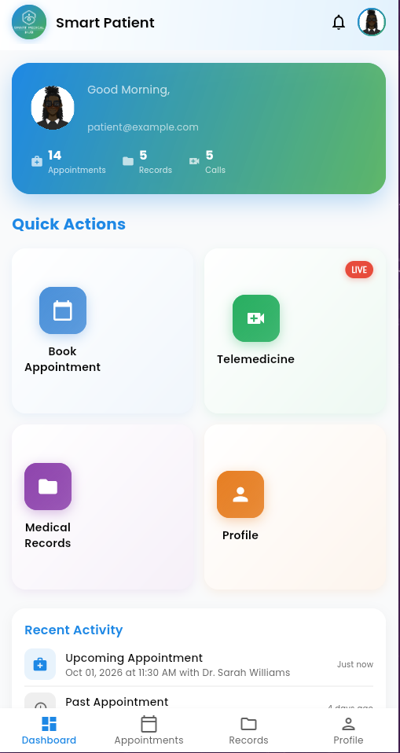
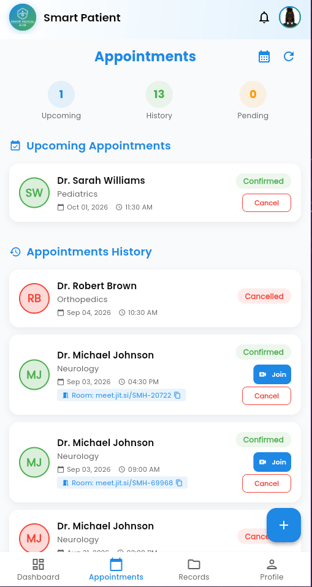
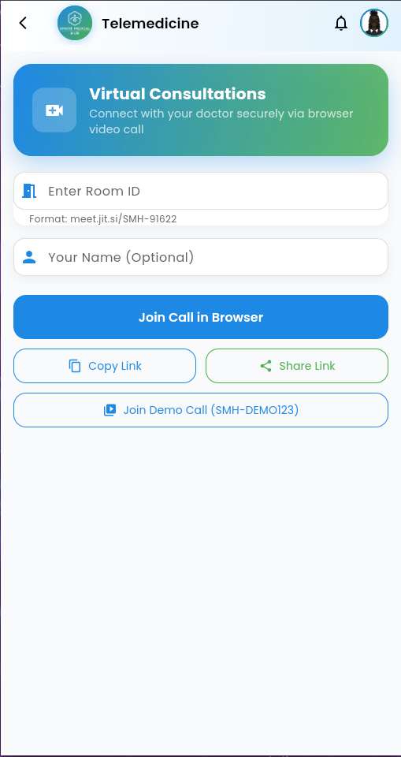
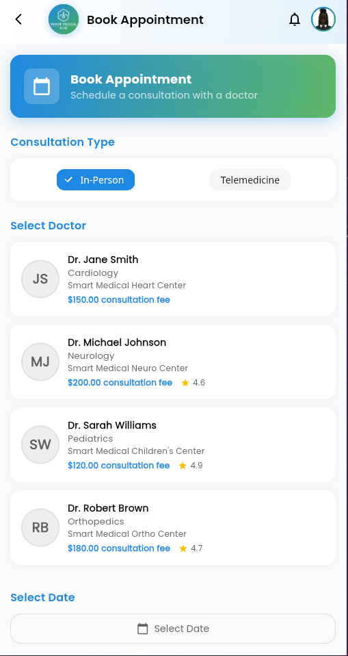
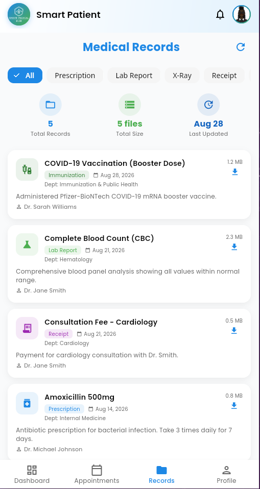
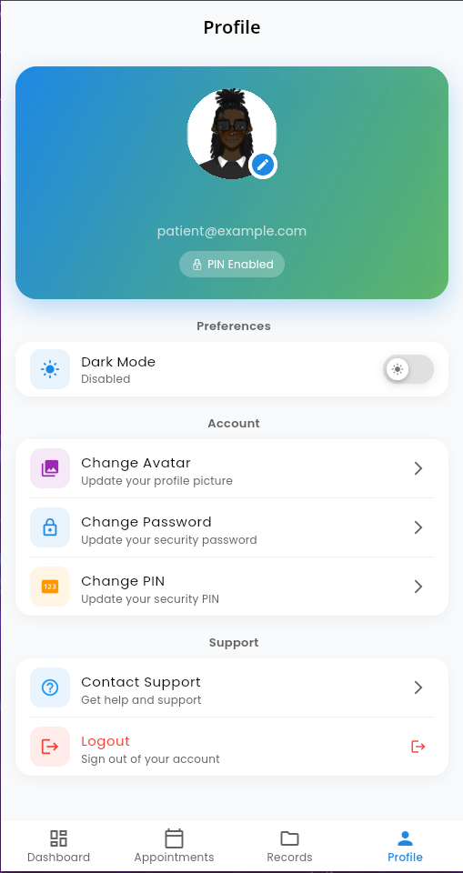
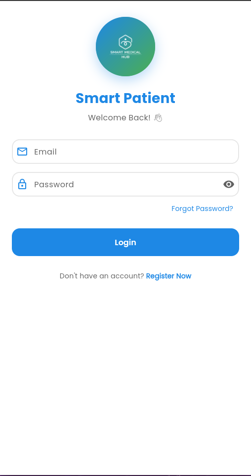
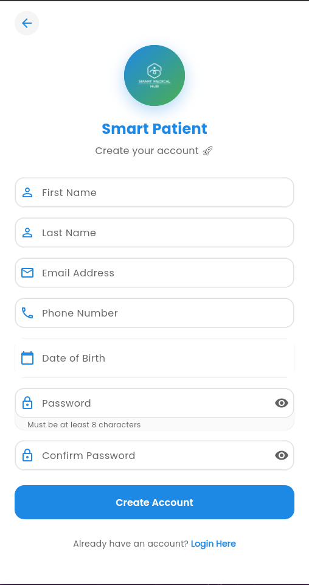
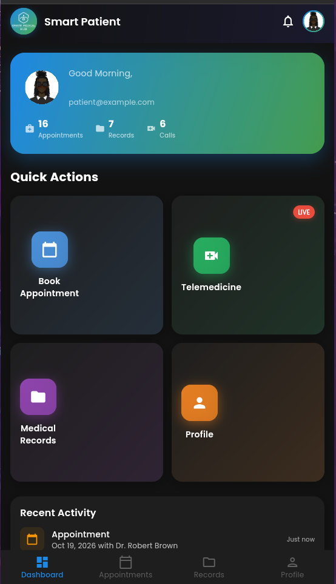

# Smart Patient 🏥

A comprehensive telemedicine and patient management mobile application that connects patients with healthcare providers for virtual consultations, appointment booking, and medical record management.

## 📱 What It Does

**Smart Patient** is a Flutter-based cross-platform application (Android, iOS, Web) that serves as the patient-facing frontend for the Smart Medical Hub ecosystem. It enables patients to:

- 🔐 **Secure Authentication** - Register, login, and set up a 4-digit PIN for quick access
- 📅 **Book Appointments** - Schedule in-person or telemedicine consultations with available doctors
- 🎥 **Video Consultations** - Join live video calls with doctors via Jitsi Meet integration
- 📋 **Medical Records** - View, filter, and download medical records as professional PDFs
- 🔔 **Notifications** - Receive real-time updates on appointments and health activities
- 👤 **Profile Management** - Manage avatars, change passwords, update PIN, and toggle dark mode
- 🌙 **Dark Mode** - Full dark theme support across all screens
- 📊 **Dashboard** - Personalized health overview with appointments, records, and telemedicine stats

## 🏗️ Architecture

The application follows a modern Flutter architecture with:

- **State Management**: Riverpod for reactive state management
- **Backend**: Flask REST API with SQLite database
- **Authentication**: JWT tokens with SHA-256 password hashing
- **Video Calls**: Jitsi Meet SDK (native) with web fallback
- **File Handling**: Custom app folder structure for avatars and downloads
- **PDF Generation**: ReportLab for professional medical record PDFs

## 📸 Screenshots

| Dashboard | Appointments | Telemedicine |
|:---------:|:------------:|:------------:|
|  |  |  |

| Book Appointment | Medical Records | Profile |
|:----------------:|:---------------:|:-------:|
|  |  |  |

| Login | Register | Dark Mode |
|:-----:|:--------:|:---------:|
|  |  |  |

## 📦 Prerequisites

Before you begin, ensure you have the following installed:

- **Flutter SDK** (>= 3.22.0) - [Install Guide](https://docs.flutter.dev/get-started/install)
- **Dart SDK** (>= 3.10.0)
- **Python** (>= 3.9) for the backend
- **Git** for version control
- **Android Studio** or **VS Code** (for mobile development)
- **Chrome** (for web development)

## 🚀 Installation

### 1. Clone the Repository

```bash
git clone https://github.com/zaephyrz/smart_patient.git
cd smart_patient
```

### 2. Backend Setup

```bash
# Navigate to backend folder
cd backend

# Create Python virtual environment
python3 -m venv venv

# Activate virtual environment
# On Linux/macOS:
source venv/bin/activate
# On Windows:
# venv\Scripts\activate

# Install Python dependencies
pip install -r requirements.txt

# Initialize the database with sample data
python -c "from app import init_db; init_db()"

# (Optional) Populate sample appointments
python populate_appointments.py

# Start the Flask backend server
python app.py
```

The backend will start on http://localhost:8000.

### 3. Frontend Setup

```bash
# In a new terminal, navigate to the frontend folder
cd frontend

# Install Flutter dependencies
flutter pub get

# Verify Flutter setup
flutter doctor

# Run on Chrome (web)
flutter run -d chrome --web-port=57475

# Run on Android
flutter run -d android

# Run on iOS (macOS only)
flutter run -d ios
```

## 🔑 Sample Credentials

Once the backend is running, use these credentials to test the app:

| Role | Email | Password |
|------|-------|----------|
| **Patient** | patient@example.com | Patient123! |
| **Admin** | admin@smartmedicalhub.com | Admin123! |
| **Doctor (Cardiology)** | doctor.smith@hospital.com | Doctor123! |
| **Doctor (Neurology)** | doctor.johnson@hospital.com | Doctor123! |
| **Doctor (Pediatrics)** | doctor.williams@hospital.com | Doctor123! |
| **Doctor (Orthopedics)** | doctor.brown@hospital.com | Doctor123! |

## 🛠️ Tech Stack

### Frontend
- **Framework**: Flutter 3.22+
- **State Management**: Riverpod
- **UI**: Material 3 with Google Fonts (Poppins)
- **Video Calls**: Jitsi Meet Flutter SDK
- **PDF**: ReportLab (backend-generated)
- **Storage**: Flutter Secure Storage + SharedPreferences

### Backend
- **Framework**: Flask
- **Database**: SQLite
- **Authentication**: JWT + SHA-256
- **PDF Generation**: ReportLab
- **Email**: Flask-Mail
- **Admin Panel**: Flask-Admin

## 📂 Project Structure

```
smart_patient/
├── backend/
│   ├── app.py                    # Main Flask application
│   ├── populate_appointments.py  # Sample data script
│   ├── admin_cli.py              # Admin CLI tool
│   ├── requirements.txt          # Python dependencies
│   ├── instance/
│   │   └── smart_patient.db      # SQLite database
│   └── uploads/                  # File uploads
│
├── frontend/
│   ├── lib/
│   │   ├── core/                 # Core services, providers, models
│   │   ├── config/               # Theme, constants, environment
│   │   ├── features/             # Feature modules
│   │   │   ├── auth/             # Login, register, PIN setup
│   │   │   ├── dashboard/        # Main dashboard
│   │   │   ├── appointments/     # Appointment management
│   │   │   ├── medical_records/  # Medical records
│   │   │   ├── telemedicine/     # Video calls
│   │   │   ├── profile/          # User profile
│   │   │   └── notifications/    # Notifications
│   │   └── shared/               # Shared widgets
│   ├── assets/                   # Images, fonts, icons
│   ├── web/                      # Web-specific files
│   │   └── index.html            # Web entry point (Jitsi API)
│   └── pubspec.yaml              # Flutter dependencies
│
├── screenshots/                  # App screenshots for README
└── README.md                     # This file
```

## 🔧 Environment Variables

Create a `.env` file in the `backend/` folder:

```env
SECRET_KEY=your-secret-key-here
DATABASE=instance/smart_patient.db
MAIL_SERVER=smtp.gmail.com
MAIL_PORT=587
MAIL_USE_TLS=true
MAIL_USERNAME=your-email@gmail.com
MAIL_PASSWORD=your-app-password
MAIL_DEFAULT_SENDER=your-email@gmail.com
FRONTEND_URL=http://localhost:57475
```

## 📊 Admin Panel

Access the admin panel at `http://localhost:8000/admin` to manage:
- Patients
- Doctors
- Appointments
- Medical Records

Login with `admin@smartmedicalhub.com / Admin123!`

## 🧪 Testing

```bash
# Frontend tests
cd frontend
flutter test

# Backend health check
curl http://localhost:8000/health
```

## 📄 License

This project is proprietary and confidential.

## 👥 Contributors

- **Lead Developer**: Shana Mudhai
- **Project**: Smart Patient for Smart Medical Hub

---

**Built with 💙 using Flutter & Flask**